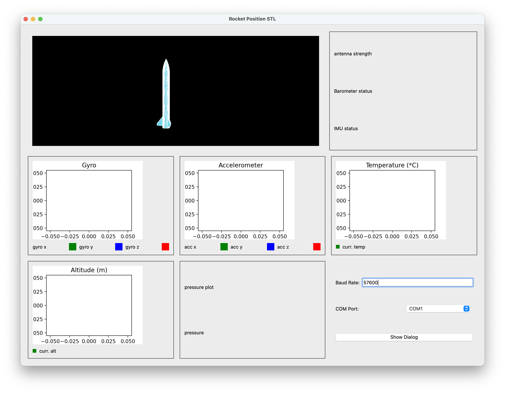

# kara-ground-control

## Overview

This is a the **Rocket Ground Control** for visualizing and monitoring real-time telemetry data from a rocket model rocket.
It features a GUI for sensor data, system health, and 3D orientation visualization.

I use it when most times when I test and fly model rockets.



---

## Features

- **3D Rocket Viewer:** Visualizes the rocket's real-time orientation using the STL model (`k01.stl`).
- **System Health Indicators (_WIP_):** Displays the status of key subsystems (antenna, barometer, IMU).
- **Sensor Widgets:** 
  - Gyroscope
  - Accelerometer
  - Temperature
  - Pressure
  - Altitude
- **Configurable Serial Communication:** Allows real-time telemetry data acquisition.
- **Notebook Calculations:** Includes a Jupyter notebook for STL visualization and rotation simulations.

---

## Notebook for Calculations

The project includes a notebook for **STL file visualization and rotation simulations**. It demonstrates:
- Loading and rendering the STL file (`k01.stl`) in 3D.
- Applying pitch, yaw, and roll rotations using a rotation matrix.
- Visualizing pre- and post-rotation states.

---

## Installation

### Requirements
- Python 3.x
- Required libraries:
  - `PyQt5`, `numpy`, `matplotlib`, `pyserial`, `numpy-stl`

Install dependencies using:
```bash
pip install PyQt5 numpy matplotlib pyserial numpy-stl
```

### Running the Application
1. Clone the repository and navigate to the project directory.
2. Run the application:
   ```bash
   python test.py
   ```

---

## Usage Notes

- **Telemetry Connection:** Update the serial port and baud rate in `test.py` (`get_telemetry()` method) to match your setup.
- **3D Viewer:** The notebook is a standalone tool for testing STL orientation and rotation logic.

---